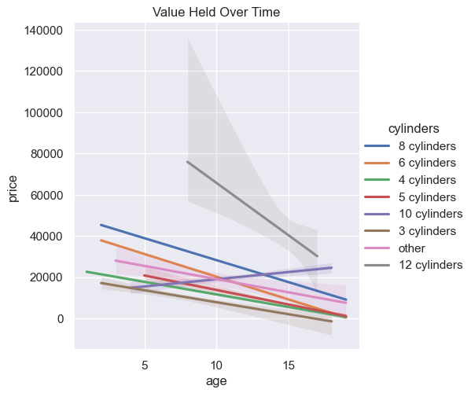

# Vehicle Analysis Report

[Link to Jupyter Notebook](analysis.ipynb)

## Dataset and Insights
Vehicle data provided included the following attributes. 

| Feature       | Type    |
|---------------|---------|
| region        | nominal |
| price         | numeric |
| year          | numeric |
| manufacturer  | nominal |
| model         | nominal |
| condition     | ordinal |
| cylinders     | nominal |
| fuel          | nominal |
| odometer      | numeric |
| title_status  | ordinal |
| transmission  | nominal |
| VIN           | nominal |
| drive         | nominal |
| size          | nominal |
| type          | nominal |
| paint_color   | nominal |
| state         | nominal |

**Average Price**: $20,472.29
**Average Odometer**: 89,554.32 Miles
**Average Age**: 10.73 years

## Key Influencing Factors
Our analysis revealed the following key factors that significantly influence vehicle pricing:

#### Age 
The newer vehicles on average had the highest value. Value start to immediatly dip as a car gets older. A increase can been seen at older ages possibly indicating antique or collectors car status.

#### Condition
Avoid purchasing vehicles in fair or salvage condition. These vehicles had the lowest value and likely not a large market seeking them. 

#### Fuel & Engine (Cylinders)
Diesel and Electric vehicles on average had the highest value. Likely due to the large engine (diesel) and large battery (electric) for operation. On average, 10 cylinder engines tend to hold their value better than others over a 20 year period. Also could be impacted by the fuel economy of these vehicles. Fuel economy data was not present in the dataset.

A predictive model indicated that an 8 cylinder engine increased the value of a vehicle as opposed to a 4 cylinder engine tended to decrease the value of a vehicle.

#### Odometer (Milage)
A vehicles value on average significantly drops as odometer increases. Odometer readings give insight on the life left in the vehicle. Higher the value, less life left in the vehicle. Customers want to but a vehicle what will last a while.

## Strategic Insights

Based on the model's insights, it is recommended that focusing on newer, low-mileage, diesel or electric vehicles will lead to aquiring higher valued vehicles for inventory.

## Limitations and Further Analysis
Expanding the dataset to include more attributes such as fuel economy, vehicle history, etc. would lead to more informed insights.

A lot of this data was removed due to missing values. I have also found that spot checking deemed some rows inacurate leading me to question the validity of the data. A better quality dataset would lead to better results.

Fine tuning a predictive model with these additional features would lead to a better insights.

